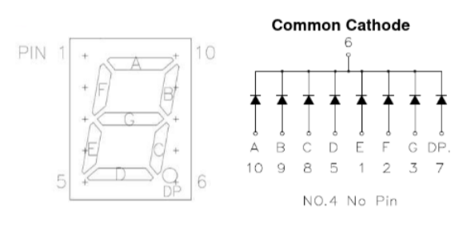
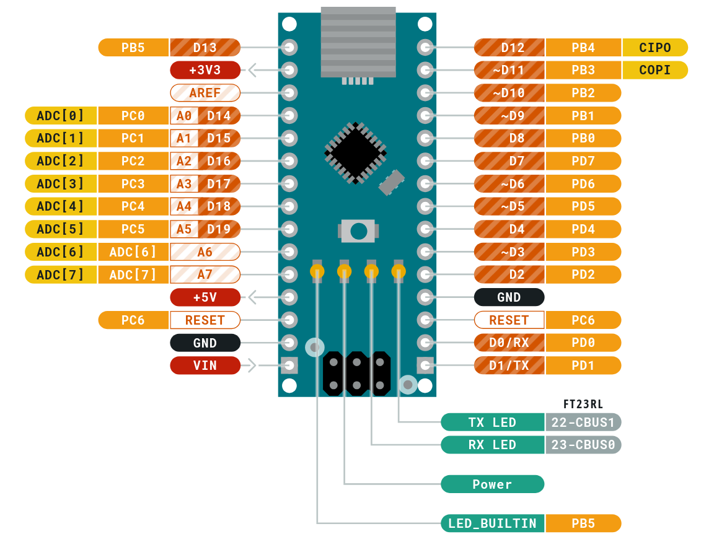
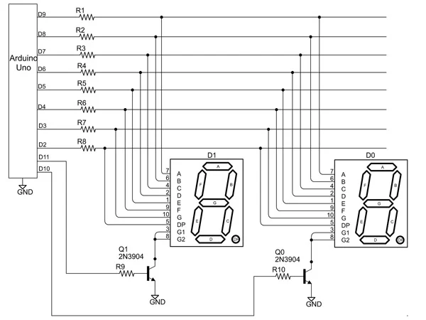

# Arduino 3 Digit Counter

## Introduction

This is an arduino project for a 3 digit counter with 2 buttons to increment and decrement 
the counter. The 3 digit display consists of 3 individual common-cathode 7-segment-display which are multiplexed to show the current value.

## Hardware

### 7 segment display

The used 7-segment-displays have following pin set:

### Arduino Nano

### Wiring

The wiring schema was taken from [www.jameco.com](https://www.jameco.com/Jameco/workshop/TechTip/working-with-seven-segment-displays.html) and extended to a third display. 

I used 330 Ohm resistors and for the transistors the [2N 3904 H331](https://www.alldatasheet.com/view_datasheet.jsp?Searchword=2N3904H331), which is a general purpose NPN transistor.

> [!Note]  
> You can also use PNP transistors as shown [here](https://electronics.stackexchange.com/questions/228857/npn-or-pnp-for-multiplex-seven-segment-display)

### Personal wiring notes

This table documents the connection and wiring of my setup with corresponding wire colors
| **Arduino Port** | **Wire Color** | **Segment** | **Display pin**  |
|------------------|----------------|-------------|------------------|
| D9               | orange         | A           | 10               |
| D8               | yellow         | B           | 9                |
| D7               | gree           | C           | 8                |
| D6               | white          | D           | 5                |
| D5               | gray           | E           | 1                |
| D4               | brown          | F           | 2                |
| D3               | black          | G           | 3                |
| D2               | blue           | DP          | 7                |

### Getting Started
1. Set up wiring
2. Connect Arduino to PC
3. Upload script
4. Let's go!!
